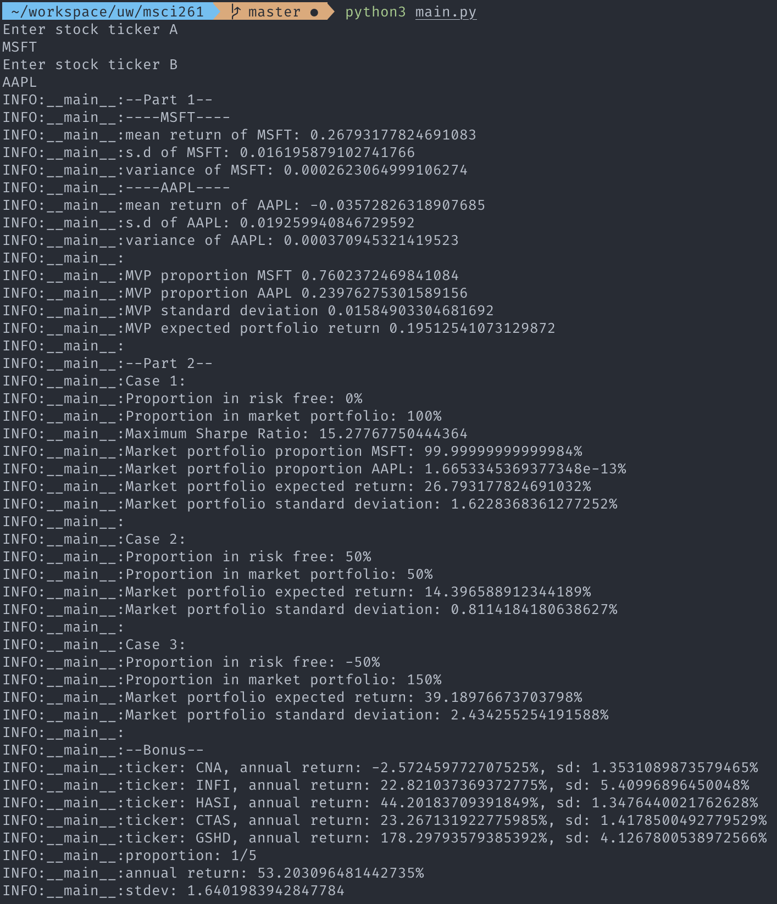

## MSCI 261 project

### Frontend Deployment Status

Frontend live at
https://msci261.web.app

| API | endpoint | request type | payload |
|---|---|---|---|
| 2 Stock | https://us-central1-msci261.cloudfunctions.net/stocks | `POST` |`{"a": "AAPL","b": "MSFT}`|
| 5 Random Stock| https://us-central1-msci261.cloudfunctions.net/random-portfolio | `POST` |  |

# Instruction

install dependecies in `requirements.txt` via pip

to run program, run `python3 main.py`

# Bonus portfolio

the stocks we used for the bonus portfolio:

- `TAS`
- `CNA`
- `UTI`
- `BFRA`
- `AN`
### Example output

